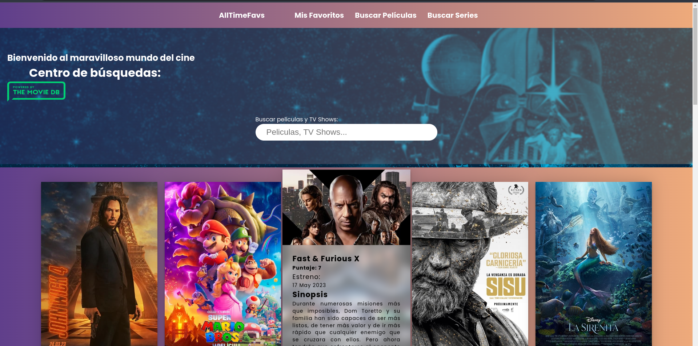

# MyTopMedia

Welcome to MyTopMedia! This project showcases a set of web pages, backend services, and a database, all seamlessly integrated using Docker and Docker Compose. It demonstrates my knowledge in various areas such as database management, backend development using Node.js, frontend development using React, and containerization with Docker.

## Project Structure

The project consists of two main folders:

1. `MyApp`: This folder contains the React frontend version of MyTopMedia along with the backend implemented in Node.js. The frontend offers an intuitive and user-friendly interface for interacting with the application.

2. `www`: This folder includes the vanilla JavaScript version of MyTopMedia along with the backend implemented in Node.js. It provides an alternative version of the application with a more lightweight and straightforward frontend.

## Preview

Here's a sneak peek of the attractive and visually appealing frontend design of MyTopMedia:



## Getting Started

To get started with MyTopMedia, please follow these steps:

1. Clone this repository to your local machine using the following command:
   ```
   git clone https://github.com/Carlos-Corona/MyTopMedia.git
   ```

2. Navigate to the appropriate folder based on your preference, either `MyApp` or `www`.


3. Open your web browser and access the application by entering the following URL:
   ```
   http://localhost:3000
   ```

   Voila! You are now ready to explore and interact with MyTopMedia.

## Technologies Used

The project incorporates the following technologies:

- **Frontend:** React, Vanilla JavaScript
- **Backend:** Node.js
- **Database:** MariaDB
- **Containerization:** Docker, Docker Compose THIS STILL IN DEVELOPMENT


